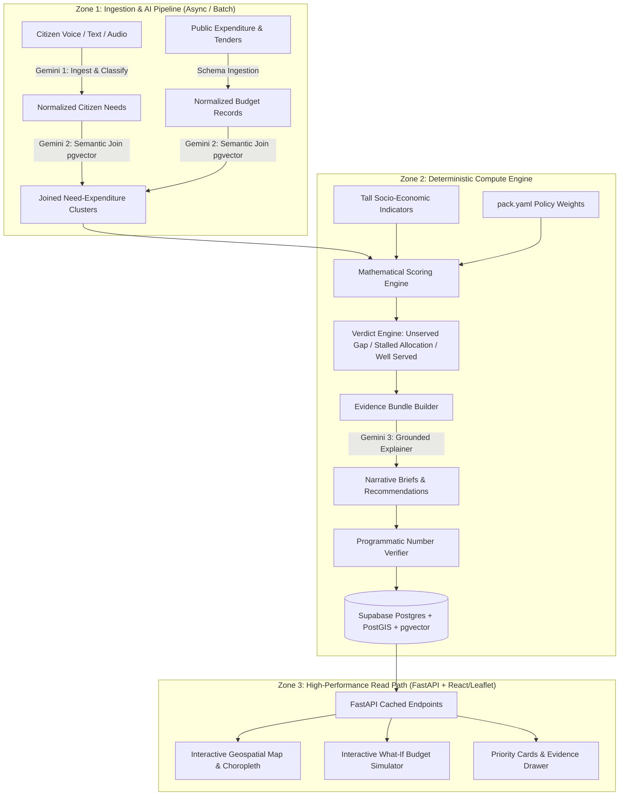

# Implementation Plan — Sangam: Multilingual Digital Public Good for Evidence-Backed Infrastructure Prioritization

Sangam joins **unstructured multilingual citizen voice** (complaints, voice notes, community reports) with **structured public expenditure records** (budgets, sanctions, tenders) to surface **Unserved Gaps** (high citizen demand, zero budget) and **Stalled Allocations** (budget allocated, problem persists).

---

## 1. Architectural Foundations & Load-Bearing Decisions

Sangam is built around 5 non-negotiable architectural principles:
1. **Tall `indicators` Schema**: Socio-economic indicators are stored tall `(region_id, indicator_code, value, year)` rather than wide columns, enabling dynamic country packs without schema migrations.
2. **Configuration-Driven Weights (`pack.yaml`)**: Priority weights (Equity vs. Reach vs. Demand vs. Expenditure Gap) live in country packs, letting ministries adjust policy trade-offs without modifying code.
3. **Model-Free Deterministic Scoring**: Gemini is never allowed to rank priorities. Priorities are ranked using transparent, reproducible mathematical formulas; Gemini generates grounded narrative explanations.
4. **Closed Evidence Bundle Verification**: AI-generated figures and claims are programmatically validated against an immutable JSON evidence bundle. Any discrepancy rejects the summary.
5. **Decoupled Dashboard Read Path**: Zero Gemini API calls on the public dashboard view. Analytics, priority rankings, and AI summaries are precomputed and cached in PostgreSQL/Supabase to prevent rate limit failures during live usage.

---

## 2. Target Data Model (8 Core Tables)

1. **`admin_regions`**: Hierarchical administrative geography (Country -> State/Province -> District -> Ward/Sub-district) with PostGIS geometries (`geom`).
2. **`citizen_reports`**: Raw and normalized citizen submissions (multilingual text/audio, transcription, detected language, sentiment, urgency, extracted sector/category, PostGIS point location).
3. **`expenditures`**: Public budget allocations, sanctioned projects, tenders, execution status, amount, department, fiscal year, geographic mapping.
4. **`indicators` (Tall Table)**: Region-level demographic and socio-economic metrics (`region_id`, `indicator_key`, `numeric_value`, `source_year`).
5. **`issue_clusters`**: Geo-spatial and semantic clusters grouping related citizen reports with associated expenditure line items.
6. **`priorities`**: Computed deterministic priority rank, index score, verdict classification (`UNSERVED_GAP`, `STALLED_ALLOCATION`, `UNDERFUNDED_CRITICAL`, `WELL_SERVED`), and formula component breakdowns.
7. **`evidence_bundles`**: Immutable JSON snapshot of ground-truth counts, expenditure amounts, citizen quotes, and indicators used for auditability.
8. **`narrative_briefs`**: Gemini-generated, verified policy explanations, root cause analyses, and action recommendations tied to evidence bundles.

---

## 3. The 3-Call AI Pipeline & Verification Contract

- **Call 1 (Citizen Ingestion & Normalization)**:
  - Model: `gemini-2.5-flash` / `gemini-1.5-pro` (multimodal audio + text)
  - Input: Raw voice audio (WAV/MP3/M4A) or text in any local language (Hindi, Kannada, Swahili, Portuguese, English, etc.).
  - Output: Strict JSON schema `{ original_language, english_translation, sector, specific_issue, urgency_score, sentiment, extracted_location_entities, pii_redacted_text }`.
- **Call 2 (Semantic Join & Entity Resolution)**:
  - Model: `text-embedding-004` / Gemini semantic similarity
  - Input: Clustered citizen demand vs. government expenditure line items.
  - Output: Matched expenditure items with semantic confidence score and allocation status.
- **Call 3 (Grounded Policy Brief Synthesis)**:
  - Model: `gemini-2.5-flash` with structured system prompt & temperature `0.1`
  - Input: Verified Evidence Bundle JSON only (no external data).
  - Output: Executive summary, why this is prioritized, fiscal gap analysis, recommended action.
- **Programmatic Verifier (Non-LLM)**:
  - Regex parser extracts all numerical values (currencies, counts, percentages) from Call 3 output and asserts that every number exists in the Evidence Bundle within tolerance. If verification fails, the brief is rejected and regenerated.

---

## 4. Phased Implementation Roadmap

### Phase 1: Foundation, Workspace & Project Setup
- Establish clean monorepo structure:
  - `backend/`: FastAPI application, database connections, Pydantic schemas, Alembic migrations.
  - `frontend/`: Vite + React + TypeScript + TailwindCSS / Modern Design System.
  - `packs/`: Country pack registry starting with `india_karnataka` and `default` template.
  - `scripts/`: Data ingestion seeders and evaluation scripts.
- Set up Supabase / PostgreSQL schema with PostGIS and pgvector extensions.
- Configure environment definitions (`GEMINI_API_KEY`, `SUPABASE_DB_URL`, etc.).

### Phase 2: Core Data Schema & Country Pack Engine
- Implement 8 core database tables via SQL migrations and SQLAlchemy models.
- Build Country Pack Loader (`pack.yaml` parser) handling:
  - Administrative boundary hierarchies.
  - Localization dictionaries and language codes.
  - Sector taxonomies (Water, Roads, Sanitation, Health, Education, Electricity).
  - Configurable priority formula weights (e.g. `w_demand`, `w_vulnerability`, `w_expenditure_gap`, `w_urgency`).
- Seed initial geo-spatial administrative boundaries and demographic indicators.

### Phase 3: AI Ingestion & Semantic Join Pipeline
- Build Gemini Audio/Text Multilingual Ingestion Worker (Call 1) with PII redaction.
- Implement PostGIS spatial clustering (ST_ClusterDBSCAN) + pgvector semantic clustering to create `issue_clusters`.
- Build the Expenditure Matching & Semantic Join Engine (Call 2).
- Create batch pipeline and seed realistic multilingual datasets (audio + text) and public expenditure records.

### Phase 4: Deterministic Scoring, Verdict Engine & Budget Simulation
- Implement the model-free deterministic priority scoring formula:
  $$\text{PriorityScore} = w_d \cdot \bar{D} + w_v \cdot V + w_g \cdot G + w_u \cdot U$$
  where $D$ is citizen demand density, $V$ is socio-economic vulnerability index, $G$ is expenditure gap ratio, and $U$ is citizen urgency.
- Implement Verdict Engine:
  - **Unserved Gap**: $\text{Demand} > \theta_d \land \text{AllocatedBudget} = 0$
  - **Stalled Allocation**: $\text{AllocatedBudget} > 0 \land \text{Demand} > \theta_d \land \text{ProjectAge} > \tau$
  - **Underfunded Critical**: $\text{AllocatedBudget} < \text{EstimatedCost} \times 0.3 \land \text{Urgency} = \text{High}$
- Build the Interactive Budget Simulation Engine:
  - Simulates allocating budget \$X to maximize priority resolution, showing trade-offs between equity and population reach.

### Phase 5: Grounded Narrative Generator & Verification Engine
- Build Evidence Bundle Generator (compiling exact counts, budget numbers, and quotes into immutable JSON).
- Implement Gemini Call 3 for executive policy briefs with strict JSON/Markdown schema.
- Implement the Programmatic Number Verifier to ensure zero hallucinations.
- Build pre-computation pipeline that writes all ready-to-serve analytics to the read-store.

### Phase 6: FastAPI Backend API Layer
- Endpoints:
  - `GET /api/v1/overview`: National/regional high-level KPIs (Total unserved gaps, total stalled capital, citizen reports).
  - `GET /api/v1/regions`: PostGIS GeoJSON endpoints with choropleth metrics.
  - `GET /api/v1/priorities`: Filterable priority ranking table with sector, verdict, and region filters.
  - `GET /api/v1/priorities/{id}`: Detailed priority view with evidence bundle, narrative brief, citizen soundbites, and budget audit trail.
  - `POST /api/v1/simulate`: Real-time budget simulation endpoint.
  - `POST /api/v1/ingest/citizen`: Citizen voice/text submission endpoint with real-time audio processing.
  - `GET /api/v1/packs`: List available country packs and active configuration.

### Phase 7: Interactive High-Aesthetic Frontend Dashboard
- Modern, responsive React + TypeScript dashboard with glassmorphic, accessible government-grade design:
  - **Global & Regional Map View**: Leaflet choropleths showing vulnerability, demand density, and stalled capital hotspots.
  - **"The Join" Split Explorer**: Side-by-side comparative visualization of Citizen Demand vs. Government Expenditure.
  - **Verdicts & Priority Matrix**: Interactive table with badge indicators (`Unserved Gap`, `Stalled Allocation`).
  - **Evidence Drawer & Policy Brief Modal**: Deep-dive inspection showing raw citizen voice quotes, expenditure breakdown, and verified Gemini brief.
  - **What-If Budget Simulator Tool**: Interactive slider to allocate simulated funds and see live impact on resolving unserved gaps.
  - **Multilingual Citizen Voice Portal**: Public-facing submission widget allowing citizens to record voice in native language or submit text.

### Phase 8: Testing, Hardening & Demonstration Packaging
- Automated unit and integration tests (scoring algorithm correctness, verifier unit tests, API tests).
- Demo seed datasets with realistic scenarios (e.g. Karnataka water supply unserved gap, stalled road asphalt tenders, rural health clinic).
- Dockerfile, docker-compose, and deployment guides for Render/Vercel/Supabase.

---

## 5. Verification Plan

### Automated Tests
- `pytest backend/tests/test_scoring.py`: Mathematical verification of scoring formulas and edge cases (zero budget, zero population, max urgency).
- `pytest backend/tests/test_verifier.py`: Verification that hallucinated numbers in AI briefs are caught and rejected.
- `pytest backend/tests/test_country_pack.py`: Validation of `pack.yaml` loading, schema parsing, and dynamic indicator queries.
- `pytest backend/tests/test_api.py`: FastAPI endpoint status codes, GeoJSON response structures, and simulation calculations.
- `npm run test` / `npm run build`: Frontend TypeScript build and component integrity verification.

### Manual & System Verification
- Voice ingestion test: Submit a recorded audio snippet in Kannada/Hindi/English -> verify Gemini Call 1 produces accurate English translation, sector tagging, and sentiment.
- Join verification: Verify that a stalled road repair in Ward X correctly maps to the 2024 municipal road sanction.
- Simulation verification: Verify interactive slider updates affected priority counts in real time.
