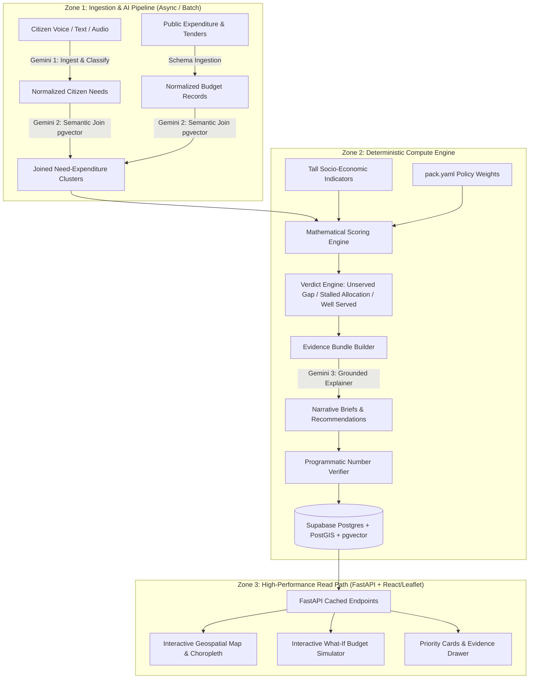

# Implementation Plan — Sangam: Multilingual Digital Public Good for Evidence-Backed Infrastructure Prioritization

Sangam joins **unstructured multilingual citizen voice** (complaints, voice notes, community reports) with **structured public expenditure records** (budgets, sanctions, tenders) to surface **Unserved Gaps** (high citizen demand, zero budget) and **Stalled Allocations** (budget allocated, problem persists).

---

## Status Note — Reconciled Against Running Code, 22 Aug 2026

This plan was written before most of Phases 1–8 were implemented. It has
since been checked line-by-line against the actual codebase and corrected
where reality diverged. Three things changed since the original draft:

1. **The pack-format fork is resolved.** `packs/india_karnataka/pack.yaml`
   is the schema of record for config (languages, sectors, scoring
   weights). `packs/india/` supplies real Jal Jeevan Mission + Local
   Government Directory data, imported into `admin_regions` and
   `indicators` via `backend/app/utils/load_real_data.py` (idempotent,
   matched on `external_id`).
2. **`engine/` has been removed.** It duplicated `backend/`'s role and was
   never imported by anything running — confirmed by grep, and
   independently flagged by a knowledge-graph pass over the repo as
   suspiciously similar to `backend/`.
3. **A citizen-facing ingest endpoint exists, but is incomplete.**
   `POST /api/v1/ingest/citizen` (in `backend/app/routes/priorities.py`)
   accepts text, calls Gemini, and persists a `CitizenReport`. It does
   **not**: accept audio, populate `reporter_hash`, resolve a place name to
   a region, or return a citizen-friendly tracking code — and it stores
   `raw_text` verbatim rather than only the redacted text. **Phase 9**
   below completes it.

Phase 9 and Phase 10 are new, added below Phase 8. Section 6 documents two
places where the running code has deliberately diverged from this plan's
original description, so the plan stops silently disagreeing with the code.

---

## 1. Architectural Foundations & Load-Bearing Decisions

Sangam is built around 5 non-negotiable architectural principles:
1. **Tall `indicators` Schema with Materialized Views**: Socio-economic indicators are stored tall `(region_id, indicator_code, value, year)` to enable dynamic country packs without schema migrations. For high-performance reads, these are flattened into PostgreSQL Materialized Views.
2. **Configuration-Driven Weights (`pack.yaml`)**: Priority weights (Equity vs. Reach vs. Demand vs. Expenditure Gap) live in country packs, letting ministries adjust policy trade-offs without modifying code.
3. **Model-Free Deterministic Scoring**: Gemini is never allowed to rank priorities. Priorities are ranked using transparent, reproducible mathematical formulas; Gemini generates grounded narrative explanations.
4. **Closed Evidence Bundle Verification**: AI-generated figures and claims are programmatically validated against an immutable JSON evidence bundle. Any discrepancy rejects the summary.
5. **Decoupled Dashboard Read Path**: Zero Gemini API calls on the public dashboard view. Analytics, priority rankings, and AI summaries are precomputed and cached in PostgreSQL/Supabase to prevent rate limit failures during live usage.
6. **Every Analysis Run Is Versioned**: `process_and_prioritize()` never deletes existing results before recomputing. Each run writes under a new `analysis_runs.id` and is marked `complete` only once every step succeeds; read endpoints serve the latest **complete** run. A crash mid-run leaves yesterday's dashboard intact instead of showing nothing — see Phase 9.2, which closes a real gap: the running pipeline currently does delete-then-recompute.

---

## 2. Target Data Model

**8 tables as originally planned, plus 2 added by Phase 9** (`analysis_runs`, `pending_intake`) to close the reliability and single-follow-up-question gaps described below. Columns marked **(added)** exist in the running schema now but were not in the original plan; columns marked **(Phase 9)** are planned, not yet built.

1. **`admin_regions`**: Hierarchical administrative geography (Country -> State/Province -> District -> Ward/Sub-district) with PostGIS geometries (`geom`, nullable — no boundary polygons exist yet for Karnataka blocks; see Phase 9.3). **(added)** `external_id` (the source pack's `unit_id`, e.g. `IN-KA-CHITRADURGA-HIRIYUR`, so `load_real_data.py` can re-import idempotently), `population` (a household-count proxy where true headcount isn't published — see the comment in `real_data_mapping.households_to_population_estimate`). **(Phase 9.3)** `name_variants` (pipe-separated alternate spellings/scripts, e.g. `Bangalore|Bengaluru|ಬೆಂಗಳೂರು` — present in `packs/india/admin_units.csv` today but currently dropped by the importer).
2. **`citizen_reports`**: Raw and normalized citizen submissions (multilingual text/audio, transcription, detected language, sentiment, urgency, extracted sector/category, PostGIS point location). **(added)** `reporter_hash` (HMAC of channel identity + server pepper — column exists, not yet populated by the live ingest endpoint). **(Phase 9.1)** `tracking_id` (short human code returned to the citizen — the trust loop), `channel` (`telegram` | `whatsapp` | `web`). **(Phase 9.3)** `region_id` (FK to `admin_regions`, set by gazetteer resolution at ingest time — the primary location path once real voice input exists; the existing lat/lon `location` point remains a fallback for reports that do carry GPS).
3. **`expenditures`**: Public budget allocations, sanctioned projects, tenders, execution status, amount, department, fiscal year, geographic mapping. **Known divergence for India — see Section 6.**
4. **`indicators` (Tall Table)**: Region-level demographic and socio-economic metrics (`region_id`, `indicator_key`, `numeric_value`, `source_year`). **(added)** `source_name`, `source_url` — a figure that cannot say where it came from should not be treated as evidence.
5. **`issue_clusters`**: Geo-spatial and semantic clusters grouping related citizen reports with associated expenditure line items. **(Phase 9.2)** `run_id` (FK to `analysis_runs`).
6. **`priorities`**: Computed deterministic priority rank, index score, verdict classification (`UNSERVED_GAP`, `STALLED_ALLOCATION`, `UNDERFUNDED_CRITICAL`, `WELL_SERVED`), and formula component breakdowns. **(Phase 9.2)** `run_id`. **(Phase 10)** `list` (`fund` | `audit` — a recommendation for money never allocated and a finding that money was spent but nothing changed are different actions and should not compete on one ranking; see `docs/DECISIONS.md` #8b).
7. **`evidence_bundles`**: Immutable JSON snapshot of ground-truth counts, expenditure amounts, citizen quotes, and indicators used for auditability. **(Phase 9.2)** `run_id`.
8. **`narrative_briefs`**: Gemini-generated, verified policy explanations, root cause analyses, and action recommendations tied to evidence bundles. **(Phase 9.2)** `run_id`.
9. **`analysis_runs`** — **new, Phase 9.2**: `id`, `status` (`running` | `complete` | `failed`), `started_at`, `completed_at`, `note`. Every clustering pass writes under one of these; read endpoints filter to the latest `status="complete"` row.
10. **`pending_intake`** — **new, Phase 9.1/9.3**: `channel_user_hash` (primary key), `channel`, `partial_report` (JSON — whatever Gemini already extracted), `awaiting` (currently always `"location"`), `expires_at` (1 hour). Backs the single-follow-up-question decision: if a citizen names no place, the bot asks exactly one question and never a second.

---

## 3. The 3-Call AI Pipeline & Verification Contract

- **Call 1 (Citizen Ingestion & Normalization)**:
  - Model: `gemini-3.5-flash-lite` (verified against the live API — `gemini-2.5-flash` / `gemini-1.5-pro` from the original draft are retired; `gemini-3.6-flash` returns 503 "high demand" reliably on the free tier, while flash-lite answers the same schema-locked extraction in ~1.2s. Availability beats capability when a demo is live.)
  - Input: Raw voice audio (OGG/Opus — what Telegram and WhatsApp actually send, accepted with no transcoding) or text in any local language. **(Phase 9.1)** the live endpoint today accepts text only; `gemini_service.analyze_citizen_report` needs an audio-accepting variant.
  - Output: Strict JSON schema `{ original_language, english_translation, sector, specific_issue, urgency_score, sentiment, extracted_location_entities, pii_redacted_text }`. **(Phase 9.3 adds)** `location_text_latin` — the same place name romanised into the spelling a government dataset would use, which is what the location resolver matches against; matching the original Kannada/Hindi script directly is unreliable because gazetteer coverage in-script is incomplete.
- **Call 2 (Semantic Join & Entity Resolution)** — **implemented differently from this description; see Section 6.** The running `clustering_engine.py` matches citizen demand to expenditure records by exact `region_id + sector`, not vector/keyword hybrid search. Embeddings are computed and stored on both `citizen_reports` and `expenditures` but not currently queried for matching.
- **Call 3 (Grounded Policy Brief Synthesis)**:
  - Model: `gemini-2.5-flash` with structured system prompt & temperature `0.1`
  - Input: Verified Evidence Bundle JSON only (no external data).
  - Output: Executive summary, why this is prioritized, fiscal gap analysis, recommended action.
- **Programmatic Verifier (Non-LLM)**:
  - An intelligent parser (handling formats like "1.5 million" vs "1,500,000" and currency symbols) extracts all numerical values from Call 3 output and asserts that every number exists in the Evidence Bundle within tolerance. If verification fails, the brief is rejected and regenerated.

---

## 4. Phased Implementation Roadmap

### Phase 1: Foundation, Workspace & Project Setup
- Establish clean monorepo structure:
  - `backend/`: FastAPI application, database connections, Pydantic schemas, Alembic migrations.
  - `frontend/`: Vite + React + TypeScript + TailwindCSS / Modern Design System.
  - `packs/`: Country pack registry starting with `india_karnataka` and `default` template.
  - `scripts/`: Data ingestion seeders and evaluation scripts.
- Set up Supabase / PostgreSQL schema with PostGIS and pgvector extensions.
- Configure environment definitions (`GEMINI_API_KEY`, `SUPABASE_DB_URL`, etc.).

### Phase 2: Core Data Schema & Country Pack Engine
- Implement 8 core database tables via SQL migrations and SQLAlchemy models.
- Create PostgreSQL Materialized Views to flatten the `indicators` tall table for high-performance frontend queries.
- Build Country Pack Loader (`pack.yaml` parser) handling:
  - Administrative boundary hierarchies.
  - Localization dictionaries and language codes.
  - Sector taxonomies (Water, Roads, Sanitation, Health, Education, Electricity).
  - Configurable priority formula weights (e.g. `w_demand`, `w_vulnerability`, `w_expenditure_gap`, `w_urgency`).
- Seed initial geo-spatial administrative boundaries and demographic indicators.

### Phase 3: AI Ingestion & Semantic Join Pipeline
- Build Gemini Audio/Text Multilingual Ingestion Worker (Call 1) with PII redaction.
- Implement PostGIS spatial clustering (ST_ClusterDBSCAN) + pgvector semantic clustering to create `issue_clusters`.
- Build the Expenditure Matching & Semantic Join Engine (Call 2).
- Create batch pipeline and seed realistic multilingual datasets (audio + text) and public expenditure records.

### Phase 4: Deterministic Scoring, Verdict Engine & Budget Simulation
- Implement the model-free deterministic priority scoring formula:
  $$\text{PriorityScore} = w_d \cdot \bar{D} + w_v \cdot V + w_g \cdot G + w_u \cdot U$$
  where $D$ is citizen demand density, $V$ is socio-economic vulnerability index, $G$ is expenditure gap ratio, and $U$ is citizen urgency.
- Implement Verdict Engine:
  - **Unserved Gap**: $\text{Demand} > \theta_d \land \text{AllocatedBudget} = 0$
  - **Stalled Allocation**: $\text{AllocatedBudget} > 0 \land \text{Demand} > \theta_d \land \text{ProjectAge} > \tau$
  - **Underfunded Critical**: $\text{AllocatedBudget} < \text{EstimatedCost} \times 0.3 \land \text{Urgency} = \text{High}$
- Build the Interactive Budget Simulation Engine:
  - Simulates allocating budget \$X to maximize priority resolution, showing trade-offs between equity and population reach.

### Phase 5: Grounded Narrative Generator & Verification Engine
- Build Evidence Bundle Generator (compiling exact counts, budget numbers, and quotes into immutable JSON).
- Implement Gemini Call 3 for executive policy briefs with strict JSON/Markdown schema.
- Implement the Programmatic Number Verifier to ensure zero hallucinations.
- Build pre-computation pipeline that writes all ready-to-serve analytics to the read-store.

### Phase 6: FastAPI Backend API Layer
- Endpoints:
  - `GET /api/v1/overview`: National/regional high-level KPIs (Total unserved gaps, total stalled capital, citizen reports).
  - `GET /api/v1/regions`: PostGIS GeoJSON endpoints with choropleth metrics.
  - `GET /api/v1/priorities`: Filterable priority ranking table with sector, verdict, and region filters.
  - `GET /api/v1/priorities/{id}`: Detailed priority view with evidence bundle, narrative brief, citizen soundbites, and budget audit trail.
  - `POST /api/v1/simulate`: Real-time budget simulation endpoint.
  - `POST /api/v1/ingest/citizen`: Citizen voice/text submission endpoint with real-time audio processing.
  - `GET /api/v1/packs`: List available country packs and active configuration.

### Phase 7: Interactive High-Aesthetic Frontend Dashboard
- Modern, responsive React + TypeScript dashboard with glassmorphic, accessible government-grade design:
  - **Global & Regional Map View**: Leaflet choropleths showing vulnerability, demand density, and stalled capital hotspots.
  - **"The Join" Split Explorer**: Side-by-side comparative visualization of Citizen Demand vs. Government Expenditure.
  - **Verdicts & Priority Matrix**: Interactive table with badge indicators (`Unserved Gap`, `Stalled Allocation`).
  - **Evidence Drawer & Policy Brief Modal**: Deep-dive inspection showing raw citizen voice quotes, expenditure breakdown, and verified Gemini brief.
  - **What-If Budget Simulator Tool**: Interactive slider to allocate simulated funds and see live impact on resolving unserved gaps.
  - **Multilingual Citizen Voice Portal**: Public-facing submission widget allowing citizens to record voice in native language or submit text.

### Phase 8: Testing, Hardening & Demonstration Packaging
- Automated unit and integration tests (scoring algorithm correctness, verifier unit tests, API tests).
- Demo seed datasets with realistic scenarios (e.g. Karnataka water supply unserved gap, stalled road asphalt tenders, rural health clinic).
- Dockerfile, docker-compose, and deployment guides for Render/Vercel/Supabase.

### Phase 9: Citizen Intake Completion, Run Reliability & Location Resolution

The dashboard, scoring engine, and verifier are built and correct. What is missing is the path from a real citizen's voice to a database row, and the guarantee that a crash mid-analysis never blanks the dashboard judges are looking at. The three sub-phases below are ordered by dependency: **9.2 has none and can start immediately; 9.1 is the prerequisite for demoing anything live; 9.3 only matters once 9.1 can actually receive a place name that isn't already a lat/lon pair.**

#### 9.1 — Complete the ingestion endpoint; add a Telegram adapter

**Why**: `POST /api/v1/ingest/citizen` exists but is text-only, never populates `reporter_hash` (so every citizen who reports through it silently falls out of the distinct-reporter flood defence in `scoring_engine.py`), stores `raw_text` verbatim rather than only the PII-redacted text, and returns a raw sequential `report_id` instead of a tracking code a citizen can hold onto. There is no channel adapter of any kind — Telegram, WhatsApp, and the brief's own "messaging apps" requirement are entirely unbuilt. Without this sub-phase, Sangam has no way for a real citizen to submit anything; every demo would be a dashboard over hand-seeded data.

**Data model**: add to `citizen_reports` — `tracking_id` (short code, unique, e.g. `SNG-4K2P`, distinct from the DB primary key so a citizen can never infer report volume or order from their own code), `channel` (`telegram` | `whatsapp` | `web`). Stop persisting `raw_text` once PII redaction succeeds; keep it only as an explicit, loudly-logged fallback if redaction itself fails.

**New files**:
- `backend/app/utils/hashing.py` — `hash_channel_user(channel_user_id: str) -> str`, HMAC-SHA256 with a `REPORTER_HASH_PEPPER` setting (new required env var, generated once with `python -c "import secrets; print(secrets.token_hex(32))"`, never committed).
- `backend/app/utils/tracking_id.py` — short, human-typeable code generator.
- `backend/app/services/telegram_adapter.py` — verifies a Telegram update, extracts `chat_id` + text or a voice `file_id`, downloads voice via Telegram's `getFile`, calls the shared ingestion function below, replies via `sendMessage` with the tracking id (and, if no location was found, the one follow-up question from `pending_intake` — see 9.3).
- `backend/app/routes/webhooks.py` — `POST /api/v1/webhooks/telegram`, thin: parse the payload, hand off to `telegram_adapter`, return 200 immediately (Telegram retries on non-200 or slow responses).

**Changed files**:
- `backend/app/services/gemini_service.py` — extend `analyze_citizen_report` to accept audio bytes + mime type as an alternative to `text_content` (the multimodal approach this project already proved works, in an earlier throwaway script now removed with `engine/` — properly homed in the service layer this time). Add `location_text_latin` to `CitizenReportAnalysis` (Phase 9.3 depends on this field existing).
- `backend/app/routes/priorities.py` — pull `ingest_citizen_report`'s body out into a shared `ingest_citizen_message()` function in a new `backend/app/services/ingestion_service.py`, so the REST endpoint and the Telegram adapter call identical logic instead of duplicating it. Set `reporter_hash`, `channel`, `tracking_id` on every created report. Return `CitizenIngestResponse` via `response_model=` instead of a raw dict.
- `backend/app/schemas/__init__.py` — `CitizenIngestResponse` gains `tracking_id: str`.

**New route**: `GET /api/v1/citizens/{tracking_id}` — the trust loop. A citizen who cannot check whether they were heard stops reporting, and a system with no incoming data has nothing to analyse.

**Build order**: hashing + tracking-id utilities (no dependencies) → extend `ingest_citizen_report` in place to use them (provable against the existing text-only path first) → pull the logic into `ingestion_service.py` → add the audio-accepting Gemini call → build the Telegram adapter and webhook route on top of the now-shared service → `GET /citizens/{tracking_id}`.

**Verification**: unit tests for `hash_channel_user` (same input → same hash, different input → different hash, output never reversible) and tracking-id generation (uniqueness, no report-id leak); an integration test posting text through `/ingest/citizen` asserting `reporter_hash`/`tracking_id`/`channel` are all populated; a manual test sending a real Telegram voice note and confirming the reply carries a tracking id.

#### 9.2 — Version every analysis run

**Why**: `process_and_prioritize()` opens by deleting every existing `Priority`, `EvidenceBundle`, `NarrativeBrief`, and `IssueCluster`, then recomputes in the same pass. If a Gemini call inside that pass fails — a real possibility given free-tier 503s during a live demo — the dashboard is left showing nothing rather than yesterday's complete results. This is the exact failure mode "degrade, never fail" (principle 6, Section 1) exists to prevent, and it is not hypothetical: it is what the running code does today.

**Data model**: new `analysis_runs` table (Section 2, item 9). Add `run_id` (FK to `analysis_runs`) to `issue_clusters`, `priorities`, `evidence_bundles`, `narrative_briefs`.

**Changed files**:
- `backend/app/services/clustering_engine.py` — remove the four `.delete()` calls at the top of `process_and_prioritize()`. At the start, create `AnalysisRun(status="running")`, commit, capture `run.id`, and stamp every row created during the pass with it. On success, set `status="complete"`, `completed_at=now()`. On any exception, set `status="failed"` in the `except` block before re-raising, rather than leaving the row stuck at `"running"` forever.
- New `backend/app/services/run_service.py` — `get_latest_complete_run_id(db) -> int | None`, the one place this lookup lives.
- Every read route currently querying `IssueCluster`/`Priority` directly (`overview.py`, `priorities.py`, `clusters.py`, `reports.py`) — filter by `get_latest_complete_run_id(db)`. If it returns `None` (no completed run yet), return an explicit "no analysis has completed yet" response rather than an empty list that reads as "nothing to report."

**Build order**: `AnalysisRun` model and `run_service.py` have no dependents and can be built and tested standalone first; then wire `clustering_engine.py`; only then touch the read routes, one at a time, each independently testable.

**Verification**: a test that runs `process_and_prioritize()` twice in a row and asserts the second run's rows never reference the first run's `run_id`; a test that forces an exception mid-run (mock a Gemini call to raise) and asserts the *previous* complete run's data is still what every read route returns; a test asserting a route returns the explicit no-data-yet response when `analysis_runs` is empty.

#### 9.3 — Location resolution (gazetteer, not geocoding)

**Why**: `citizen_reports.location` is a raw lat/lon point with no path to get there from a citizen saying "Hiriyur, Chitradurga" — the entire reason this project doesn't use Google's Geocoding API is that it needs a billing account this project doesn't have. `packs/india/admin_units.csv` already carries `name_variants` for exactly this purpose (alternate spellings, Kannada script, pre-2014 district names like "Gulbarga" for "Kalaburagi") but `real_data_mapping.map_admin_unit_row` currently drops that column on import.

**Data model**: add `name_variants` (`Text`, pipe-separated, matching the CSV's own format) to `admin_regions`. Add `region_id` (FK to `admin_regions`) to `citizen_reports` — the primary location path for real data, since no boundary polygons exist yet to support the spatial nearest-ward query `clustering_engine.py` already has for lat/lon points.

**Changed files**:
- `backend/app/utils/real_data_mapping.py` — `map_admin_unit_row` gains `name_variants` in its returned dict (already present in the source CSV, simply not read today).
- `backend/app/utils/load_real_data.py` — pass `name_variants` through on create/update.

**New file**:
- `backend/app/services/location_resolver.py` — `resolve_location(location_text_latin: str, country_code: str, db: Session) -> AdminRegion | None`. Loads every region's `name` + `name_variants` for the country into memory (259 rows for Karnataka — trivial), tries an exact case-insensitive match first, then a fuzzy match (`rapidfuzz`, new dependency — small, no service to run) against the same pool. Deliberately in Python rather than Postgres `pg_trgm`: `pg_trgm` isn't enabled in `db_init.py` yet, and at this row count in-memory fuzzy matching is fast enough that adding a third Postgres extension isn't worth the risk this close to a deadline.

**Wire into ingestion**: in `ingestion_service.ingest_citizen_message` (built in 9.1), after Gemini Call 1 returns `location_text_latin`, call `resolve_location()`. If it resolves, set `citizen_reports.region_id` directly — no spatial query needed. If it does not resolve and the report has no lat/lon either, write a `pending_intake` row and have the channel adapter ask the one follow-up question; if the citizen never answers within the hour, the report stays unresolved, excluded from clustering, and counted in an explicit "unresolved" figure on the dashboard rather than silently dropped.

**Changed**: `clustering_engine.py`'s region-attribution step (already fixed to do a real `ST_Contains`/`ST_Distance` spatial query instead of always picking the first ward) should now *prefer* `citizen_reports.region_id` when the resolver already set it, and only fall back to the spatial query for reports that arrived with a raw GPS point and no resolvable place name.

**Build order**: fix `name_variants` in the importer first (small, testable against the real CSV with no other dependency) → `location_resolver.py` as a pure function taking a list of regions + a query string, testable without a live database using fixture data → wire it behind a live DB session → integrate into `ingestion_service` → update `clustering_engine.py`'s preference order last, since it touches already-fixed code.

**Verification**: unit tests for `resolve_location` against a small fixed region fixture covering exact match, a known alternate spelling ("Bangalore" → Bengaluru Urban), a pre-2014 name ("Gulbarga" → Kalaburagi), and a genuinely unresolvable string (returns `None`, never guesses); an end-to-end test posting a citizen report whose text names a real Karnataka block and asserting `region_id` resolves to the correct row; a test confirming an unresolvable location produces a `pending_intake` row rather than a silently null region.

### Phase 10: Secondary Gaps

Lower urgency than Phase 9 — each is a real, agreed decision with no implementation yet, but none blocks a demo the way Phase 9's items do.

- **Two-list split** (`docs/DECISIONS.md` #8b): add `priorities.list` (`fund` | `audit`). A cluster where `allocated_budget == 0` competes on the `fund` list; a cluster where `stalled_status` is true routes to `audit` instead of competing on `fund` — money-was-never-allocated and money-was-spent-but-nothing-changed are different actions for a policymaker and should not be ranked against each other.
- **Aggregation floor enforced at the API boundary**: `scoring_engine.py` already computes `suppressed` (fewer than `min_distinct_reporters`, a privacy floor so a two-person village cluster can't identify its own complainants) but no read route checks it before returning results. `routes/priorities.py` and `routes/clusters.py` need to drop or mask `suppressed=True` rows before they reach the frontend.

---

## 5. Verification Plan

### Automated Tests
- `pytest backend/tests/test_scoring.py`: Mathematical verification of scoring formulas and edge cases (zero budget, zero population, max urgency).
- `pytest backend/tests/test_verifier.py`: Verification that hallucinated numbers in AI briefs are caught and rejected.
- `pytest backend/tests/test_country_pack.py`: Validation of `pack.yaml` loading, schema parsing, and dynamic indicator queries.
- `pytest backend/tests/test_api.py`: FastAPI endpoint status codes, GeoJSON response structures, and simulation calculations.
- `npm run test` / `npm run build`: Frontend TypeScript build and component integrity verification.
- `pytest backend/tests/test_hashing.py` **(Phase 9.1)**: reporter-hash determinism and non-reversibility, tracking-id uniqueness.
- `pytest backend/tests/test_ingestion_service.py` **(Phase 9.1)**: shared ingestion logic populates `reporter_hash`/`channel`/`tracking_id` regardless of which caller (REST route or Telegram adapter) invokes it.
- `pytest backend/tests/test_run_versioning.py` **(Phase 9.2)**: two consecutive runs never mix `run_id`s; a forced mid-run failure leaves the previous complete run's data intact and readable; a route returns the explicit no-data-yet response when `analysis_runs` is empty.
- `pytest backend/tests/test_location_resolver.py` **(Phase 9.3)**: exact match, known alternate spelling, pre-2014 district name, and genuinely unresolvable input, against a small fixed region fixture (no live database required).

### Manual & System Verification
- Voice ingestion test: Submit a recorded audio snippet in Kannada/Hindi/English -> verify Gemini Call 1 produces accurate English translation, sector tagging, and sentiment. **Not currently executable — the live endpoint accepts text only; becomes testable once Phase 9.1's audio-accepting `analyze_citizen_report` variant lands.**
- Telegram end-to-end test **(Phase 9.1)**: send a real voice note to the bot in Kannada or Hindi, confirm the reply carries a tracking id, confirm `GET /citizens/{tracking_id}` returns the report.
- Join verification: Verify that a stalled road repair in Ward X correctly maps to the 2024 municipal road sanction.
- Simulation verification: Verify interactive slider updates affected priority counts in real time.
- Reliability test **(Phase 9.2)**: kill the process mid-`process_and_prioritize()` run (e.g. `SIGKILL` during a batch), restart, confirm the dashboard still shows the previous complete run rather than an empty state.

---

## 6. Known Deferred Divergences from the Original Design

Two places where the running system intentionally does something different from what an earlier version of this plan described. Recorded here so the plan stops silently disagreeing with the code.

1. **The Call 2 semantic join is an exact match, not vector/hybrid search.** `clustering_engine.py` matches citizen demand to expenditure records by `region_id + sector` equality. `citizen_reports.embedding` and `expenditures.embedding` are computed and stored but not queried. This is a reasonable simplification once region and sector are already known — vector similarity earns its keep for *cross-language clustering of citizen requests themselves* (which does use embeddings, correctly), not for a join where both sides already share an exact key. Not scheduled for rework unless a real need for fuzzy expenditure matching surfaces in testing.

2. **India has no district-level sanctioned-budget data, so the `expenditures`-driven verdict model (`UNSERVED_GAP` requires `allocated_budget == 0`) cannot produce a verdict for real Karnataka regions.** This was discovered, not assumed: government sources publish state-level JJM financial sanctions, never a district or block breakdown. Real Karnataka data instead carries delivery-rate indicators (`water.households_connected`, `water.households_connected_2019`, `demography.rural_households` — see `packs/india/indicators.csv`), from which a "this block delivered 65.5% while its own district delivered 88.5%" finding is computable without ever inventing a rupee figure. Wiring a delivery-rate-based verdict path for regions with no `Expenditure` rows is a genuine open design decision — not solved by this plan, and not something to solve by fabricating `Expenditure` rows to force `STALLED_ALLOCATION` to fire. Flagged for a short design conversation before more code is written around it.
